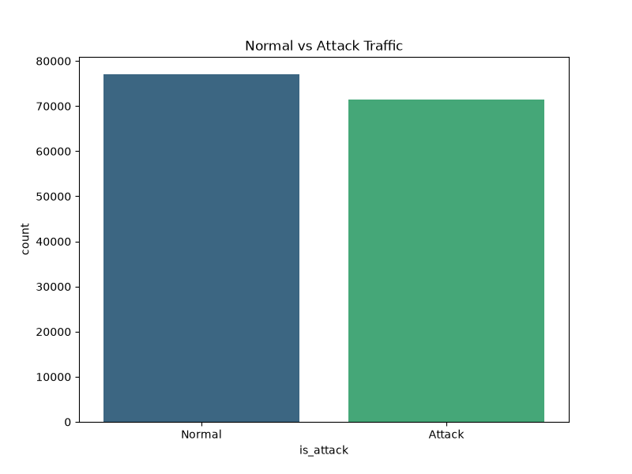
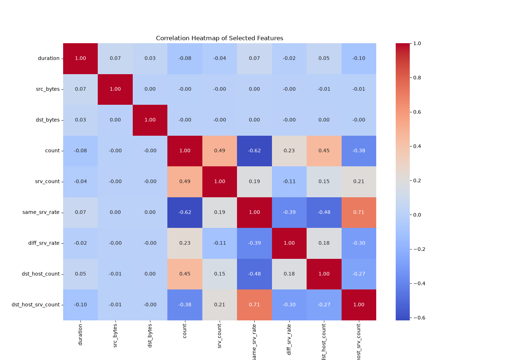

# Intrusion Detection System (IDS) Using Machine Learning

   

### 🌐 [Click Here to View Live Streamlit Web App](https://idsproject-irnkyzypgidcuhtu4bdvzf.streamlit.app)) *(Placeholder)*
### 🔴 [Click Here to View Live Power BI Dashboard](https://app.powerbi.com/view?r=eyJrIjoiNGNhZWNiZGMtNGY4Ny00ZDg4LTgxNjYtNDFhOTE1ZDE4NWFlIiwidCI6ImUxNGU3M2ViLTUyNTEtNDM4OC04ZDY3LThmOWYyZTJkNWE0NiIsImMiOjEwfQ%3D%3D&embedImagePlaceholder=true)

This is a complete end-to-end Data Science portfolio project that classifies network traffic as `Normal` or an `Attack` (DoS, Probe, R2L, U2R) using the NSL-KDD dataset.

<p align="center">
  
  
</p>

## Features
- **Data Collection & Cleaning**: Automated scripts to download and clean the dataset.
- **Exploratory Data Analysis (EDA)**: Script to generate 15+ analytical charts.
- **SQL Database Integration**: MySQL (and SQLite fallback) schemas and analytical queries.
- **Machine Learning Models**: Random Forest, Decision Tree, Logistic Regression, KNN, Naive Bayes trained and evaluated.
- **Prediction App**: A Streamlit web application for real-time traffic classification.
- **Power BI Integration**: Dataset exported to Excel, with instructions for creating a Power BI dashboard.

<p align="center">
  
  
</p>

## Folder Structure
- `dashboard/`: Contains the Power BI dashboard file (`IDS_Dashboard.pbix`).
- `dataset/`: Contains download script and raw dataset files.
- `excel/`: Contains the cleaned dataset `.xlsx` for Power BI.
- `sql/`: Contains database schema, queries, and Python DB import scripts.
- `notebooks/`: Contains the EDA Python script (generates 15 charts).
- `models/`: Contains the ML training script and the serialized models.
- `app/`: Contains the Streamlit web application.
- `reports/`: Contains the project report and Power BI setup guide.
- `screenshots/`: Contains the EDA generated charts.

## Setup Instructions

1. **Install Requirements**:
   ```bash
   pip install -r requirements.txt
   ```

2. **Download and Clean Data**:
   ```bash
   python3 dataset/download_data.py
   python3 dataset/data_cleaning.py
   ```
   *(This will create `Cleaned_NSL_KDD.csv` and `excel/Cleaned_NSL_KDD.xlsx`)*

3. **Database Setup**:
   Ensure you have a local MySQL server running or it will fallback to SQLite.
   ```bash
   python3 sql/db_manager.py
   ```

4. **Generate EDA Charts**:
   ```bash
   python3 notebooks/EDA.py
   ```
   *(Check the `screenshots/` folder for 15 generated charts)*

5. **Train Machine Learning Models**:
   ```bash
   python3 models/train.py
   ```

6. **Run Streamlit Application**:
   ```bash
   streamlit run app/main.py
   ```

7. **Power BI Dashboard**:
   Open `reports/PowerBI_Guide.md` and follow the instructions to build the dashboard using the generated Excel file.
