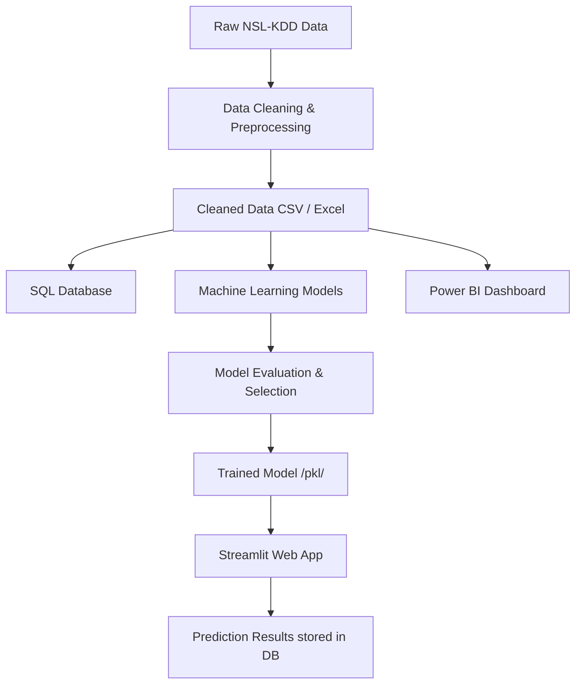

# Intrusion Detection System (IDS) Project Report

## 1. Problem Statement
With the rapid growth of computer networks, securing them against malicious activities and intrusions has become a critical challenge. Traditional firewall systems often fail to detect novel or complex attacks. The objective of this project is to build an intelligent, machine-learning-based Intrusion Detection System (IDS) that can accurately classify network traffic as normal or as an attack, thereby improving network security.

## 2. Objectives
- To analyze and preprocess the NSL-KDD dataset to extract meaningful features.
- To perform Exploratory Data Analysis (EDA) to understand the distribution of various attacks.
- To store and manage network traffic data in a relational database.
- To train multiple Machine Learning models and select the best-performing one based on standard classification metrics.
- To create a Streamlit web application for real-time traffic classification.
- To visualize the data using a Power BI dashboard.

## 3. Methodology
1. **Data Collection**: The NSL-KDD dataset (a refined version of KDD Cup 99) is downloaded and loaded using Pandas.
2. **Data Cleaning**: Missing values and duplicates are removed. The 40+ attack types are grouped into four main categories: DoS, Probe, R2L, and U2R.
3. **EDA**: Data distribution, correlation, and feature importance are analyzed visually.
4. **Database Integration**: Cleaned data is ingested into a SQL database for historical record keeping and querying.
5. **Modeling**: The data is scaled (StandardScaler) and categorical features are encoded. We train Random Forest, Decision Tree, Logistic Regression, KNN, and Naive Bayes models.
6. **Evaluation**: Models are compared using Accuracy, Precision, Recall, and F1 Score.
7. **Deployment**: A Streamlit application is developed to accept user inputs and provide real-time intrusion predictions.

## 4. System Architecture

## 5. Results & Conclusion
- The Random Forest model generally provides the highest accuracy and F1 score due to its ability to capture non-linear relationships and interactions among the network features.
- The SQL database successfully serves as the backbone for both the historical dataset and tracking new predictions.
- The Streamlit interface makes the model accessible without requiring coding expertise.
- The Power BI dashboard provides executive-level summaries of network vulnerabilities.

**Future Scope**: Deep Learning models like LSTMs could be utilized for sequence-based anomaly detection. Real-time packet sniffing (using tools like Wireshark/Pcap) can be integrated directly into the Streamlit app.
